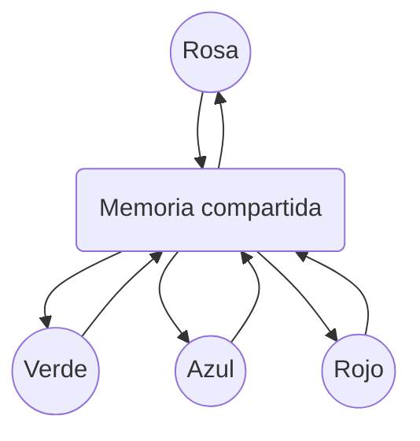

Se desea realizar un programa que realice las siguientes especificaciones.

# **Funcionalidades:**
El **_proceso Rosa_** tomará las calificaciones de un archivo con extensión **_txt,_** el cual recibe como argumento (ruta).

El **_proceso Azul_** calculará el promedio de las calificaciones de un conjunto de calificaciones.

El **_proceso Rojo_** calculará la cantidad de alumnos que acreditaron el curso con calificaciones mayores o iguales a 7.

El **_proceso Verde_** calculará la cantidad de alumnos que reprobaron el curso.

El **proceso Rosa** les comunicará a otros 3 procesos las calificaciones usando una memoria compartida.

Los **_procesos Verde, Azul y Rojo_** tomarán los datos una vez que estén listos y devolverán su resultado a través de la misma memoria compartida.

**_El proceso Rosa_** imprime el resultado de las 3 operaciones ejecutadas.

El programa debe funcionar para cualquier cantidad de calificaciones.